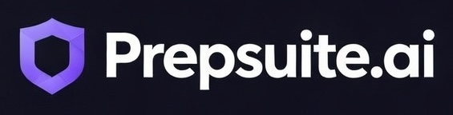
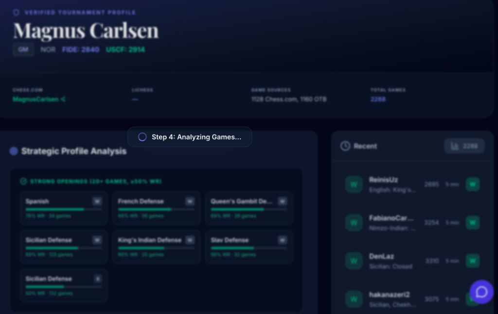
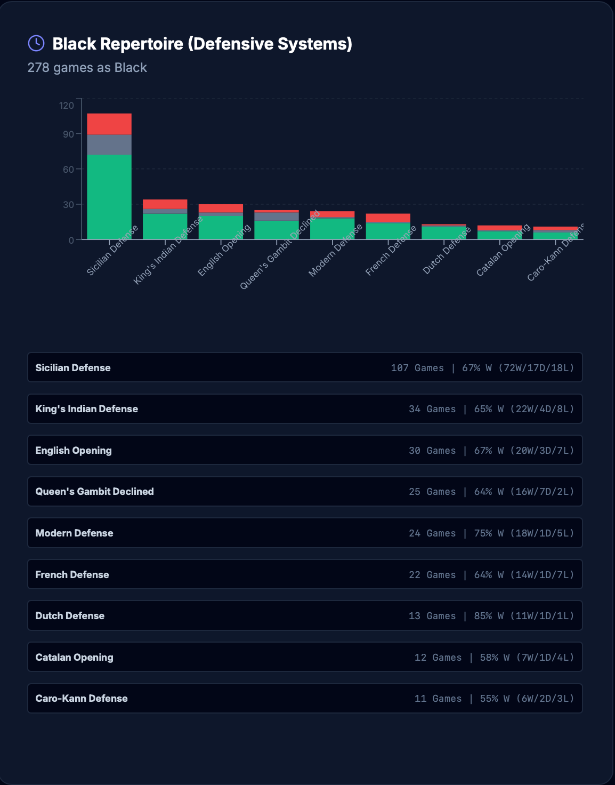

<p align="center">
  <a href="https://prepsuite.ai">
    
  </a>
</p>

<p align="center">
  <strong>The chess scouting platform that links OTB tournament data with online accounts using AI.</strong>
</p>

<p align="center">
  <a href="https://prepsuite.ai">Live Site</a> ·
  <a href="#how-the-pipeline-works">How It Works</a> ·
  <a href="#getting-started">Getting Started</a> ·
  <a href="#community">Community</a>
</p>

---

## About PrepSuite

PrepSuite is a full-stack chess opponent analysis platform used by **100+ competitive players** and growing. It aggregates player data across Chess.com, Lichess, FIDE, and USCF, then runs a multi-phase AI pipeline to produce detailed scouting reports — complete with opening repertoire breakdowns, time management patterns, strategic vulnerability analysis, and actionable game-day advice.

Unlike existing tools that only cover one platform or one data source, PrepSuite is the first to **cross-reference online and over-the-board identities using AI** — resolving a FIDE-rated tournament player to their Chess.com and Lichess accounts automatically.

<p align="center">
  
</p>

### Why players use it

- **Tournament prep in minutes, not hours.** Search any opponent by name and get a full scouting dossier — opening tendencies, clock habits, win/loss patterns — without manually digging through multiple websites.
- **AI-powered identity resolution.** Enter a FIDE name and PrepSuite finds their Chess.com and Lichess accounts automatically using Google Gemini.
- **Over-the-board + online data, unified.** The only tool that merges OTB tournament games (via FIDE/USCF) with online blitz, rapid, and bullet games into a single analysis.
- **Exportable PDF reports.** Download a print-ready scouting report with charts, stats, and tactical summaries to bring to the tournament hall.

---

## How the Pipeline Works

PrepSuite's analysis engine is a **multi-phase pipeline service** built on Node.js and Hono, deployed to Google Cloud Run. When a user submits a search, the pipeline executes the following phases and streams real-time progress back to the client via Server-Sent Events (SSE):

```
┌─────────────────────────────────────────────────────────────────────┐
│                        User submits search                         │
│                  (name, FIDE ID, or username)                      │
└────────────────────────────┬────────────────────────────────────────┘
                             │
                             ▼
┌─────────────────────────────────────────────────────────────────────┐
│  Phase 1 — Identity Resolution                                     │
│  • Query FIDE database for player profile and rating history       │
│  • Query USCF database for US tournament data                      │
│  • Use Google Gemini AI to resolve online usernames                │
│    (Chess.com / Lichess) from the player's real name               │
│  • Cross-validate candidates against known rating ranges           │
└────────────────────────────┬────────────────────────────────────────┘
                             │
                             ▼
┌─────────────────────────────────────────────────────────────────────┐
│  Phase 2 — Game Fetching (parallelized)                            │
│  • Fetch OTB games from FIDE game archive (PGN format)             │
│  • Fetch online games from Chess.com API (batch, rate-limited)     │
│  • Fetch online games from Lichess API (ndjson stream)             │
│  • Merge and deduplicate across sources                            │
│  • Configurable limit (up to 2,500 games)                          │
└────────────────────────────┬────────────────────────────────────────┘
                             │
                             ▼
┌─────────────────────────────────────────────────────────────────────┐
│  Phase 3 — PGN Parsing & Opening Classification                    │
│  • Parse each PGN with chess.js move validation                    │
│  • Classify openings via ECO code lookup + move-sequence matching  │
│  • Parallelized across worker pool for large game sets             │
│  • Compute per-opening statistics: W/D/L, win rate, frequency      │
│  • Split stats by source (OTB vs. online) and by color             │
└────────────────────────────┬────────────────────────────────────────┘
                             │
                             ▼
┌─────────────────────────────────────────────────────────────────────┐
│  Phase 4 — AI Report Generation                                    │
│  • Aggregate all statistics into a structured prompt               │
│  • Call Google Gemini (with multi-model fallback chain) to         │
│    generate strategic insights, vulnerability analysis,            │
│    and game-day recommendations                                    │
│  • Generate time management advice from clock data                 │
│  • Post-process and validate the AI output                         │
└────────────────────────────┬────────────────────────────────────────┘
                             │
                             ▼
┌─────────────────────────────────────────────────────────────────────┐
│  Output — Scouting Report                                          │
│  • Streamed to client via SSE as each phase completes              │
│  • Saved to Supabase (30-day cache per user)                       │
│  • Exportable as multi-page PDF with section-aware page breaks     │
│  • Interactive repertoire analysis board with move tree navigation  │
│  • AI chat for follow-up questions about the opponent's repertoire │
└─────────────────────────────────────────────────────────────────────┘
```

<p align="center">
  
</p>

---

## Features

| Feature | Description |
|---|---|
| **Multi-Source Identity Resolution** | Search by name, FIDE ID, USCF ID, Chess.com username, or Lichess username. AI links identities across platforms. |
| **Opening Repertoire Analysis** | Stacked W/D/L charts for White and Black, split by OTB vs. online, with per-opening win rates and game counts. |
| **Interactive Analysis Board** | Click through an opponent's most-played opening lines with a notation breadcrumb and quick insights. |
| **Time Management Profiling** | Flag game analysis, win/loss by termination type, clock pressure patterns across time controls. |
| **Tactical Summary** | AI-generated bullet points highlighting the opponent's weakest openings and clock vulnerabilities. |
| **Repertoire Chat** | Ask follow-up questions about the opponent's repertoire in a conversational AI interface. |
| **PDF Export** | Download the full report as a formatted multi-page PDF with charts, stats, and tactical summaries. |
| **Guest Trial Mode** | Try the platform without signing up — analyze up to 500 games from the landing page. |
| **Report History** | Save, revisit, and manage past scouting reports tied to your account. |
| **FIDE Rating History** | Visualize an opponent's classical, rapid, and blitz rating progression over time. |

---

## Tech Stack

| Layer | Technologies |
|---|---|
| **Frontend** | React 19, TypeScript 5.8, Vite 6, Tailwind CSS 4 |
| **Backend (Pipeline)** | Node.js, Hono, Google Cloud Run |
| **AI** | Google Gemini (multi-model fallback chain) |
| **Database & Auth** | Supabase (PostgreSQL + Row-Level Security + Auth) |
| **Serverless** | Supabase Edge Functions (Deno) |
| **Chess Logic** | chess.js (PGN parsing, move validation) |
| **Visualization** | Recharts, react-chessboard |
| **Testing** | Vitest (unit, 70%+ coverage), Playwright (E2E) |
| **Error Tracking** | Sentry |
| **Deployment** | Vercel (frontend), Cloud Run (pipeline), Supabase (DB/auth/functions) |

---

## Architecture

```
                    ┌──────────────┐
                    │   Browser    │
                    │  (React/TS)  │
                    └──────┬───────┘
                           │ HTTPS
                    ┌──────▼───────┐
                    │    Vercel    │
                    │  (Frontend)  │
                    └──────┬───────┘
                           │ /api/* proxy
                    ┌──────▼───────┐         ┌───────────────┐
                    │  Cloud Run   │────────▶│  Google Gemini │
                    │  (Pipeline)  │         │   (AI Models)  │
                    └──────┬───────┘         └───────────────┘
                           │
              ┌────────────┼────────────┐
              ▼            ▼            ▼
        ┌──────────┐ ┌──────────┐ ┌──────────┐
        │ Chess.com│ │  Lichess │ │   FIDE   │
        │   API    │ │   API    │ │  + USCF  │
        └──────────┘ └──────────┘ └──────────┘
                           │
                    ┌──────▼───────┐
                    │   Supabase   │
                    │  (Postgres)  │
                    │  Auth + RLS  │
                    └──────────────┘
```

---

## Project Structure

```
prepsuite/
├── src/                        # Frontend application
│   ├── App.tsx                 # Root component, state management, routing
│   ├── types.ts                # Core TypeScript interfaces
│   ├── components/             # React components
│   │   ├── LandingPage.tsx     # Public landing page with guest trial
│   │   ├── SearchScreen.tsx    # Search form and analysis configuration
│   │   ├── ReportDashboard.tsx # Full scouting report display
│   │   ├── RepertoireChat.tsx  # AI chat for repertoire questions
│   │   ├── AnalysisBoard.tsx   # Interactive chessboard with move tree
│   │   └── ...
│   ├── services/               # API clients
│   │   ├── pipelineClient.ts   # SSE client for the pipeline service
│   │   └── playerRepository.ts # Supabase CRUD for players/reports
│   ├── lib/                    # Utilities (Supabase, Zod, PDF export, Sentry)
│   └── hooks/                  # Custom React hooks
├── pipeline-service/           # Backend analysis pipeline (Node/Hono)
│   ├── src/
│   │   ├── pipeline/           # Core pipeline modules
│   │   │   ├── identityResolver.ts   # AI-powered cross-platform identity matching
│   │   │   ├── gameFetcher.ts        # Multi-source game aggregation
│   │   │   ├── openingClassifier.ts  # ECO code lookup + move classification
│   │   │   ├── geminiReport.ts       # AI report generation
│   │   │   └── geminiFallback.ts     # Multi-model fallback chain
│   │   ├── routes/             # HTTP endpoints (/api/analyze, /api/chat)
│   │   └── lib/                # Shared utilities
│   └── __tests__/              # Pipeline unit tests
├── supabase/
│   ├── functions/              # Edge functions (delete-user, health)
│   └── migrations/             # Database migrations (players, scouting_reports)
├── e2e/                        # Playwright E2E tests
└── docs/                       # Architecture, deployment, security docs
```

---

## Getting Started

### Prerequisites

- Node.js 18+
- npm
- Supabase account
- Google Gemini API key

### Quick Start

```bash
# Clone the repository
git clone https://github.com/your-username/prepsuite.git
cd prepsuite

# Install frontend dependencies
npm install

# Set up environment variables
cp .env.example .env.local
# Edit .env.local with your Supabase URL and anon key

# Set up and start the pipeline service
cd pipeline-service
cp .env.example .env
# Edit .env with SUPABASE_JWT_SECRET, SUPABASE_URL, GEMINI_API_KEY
npm install && npm run dev    # Runs on port 8080

# In another terminal — start the frontend
cd ..
npm run dev                   # Runs on port 3000
```

The Vite dev server proxies `/api/*` to the pipeline service automatically.

### Database Setup

```bash
supabase link --project-ref your-project-ref
supabase db push
supabase functions deploy delete-user
supabase functions deploy health
```

---

## Available Scripts

| Command | Description |
|---|---|
| `npm run dev` | Start dev server (port 3000) |
| `npm run build` | Production build (strips console.log/debugger) |
| `npm run preview` | Preview production build |
| `npm test` | Run Vitest in watch mode |
| `npm run test:run` | Run Vitest once (CI mode) |
| `npm run test:coverage` | Run with coverage (70% threshold) |
| `npm run test:e2e` | Playwright E2E tests (Chromium, Firefox, WebKit) |
| `npm run test:all` | Unit tests + E2E tests |

---

## Security

- **Server-side secrets only** — All API keys (Gemini, Supabase service role) stored exclusively in the pipeline service and edge functions
- **JWT verification** — Every pipeline request validated against Supabase JWT secret
- **Input validation** — Zod schemas on all user inputs before processing
- **Row-Level Security** — Supabase RLS policies enforce per-user data isolation
- **Rate limiting** — IP-based rate limiting on guest analysis endpoints

See [`docs/SECURITY_AUDIT.md`](docs/SECURITY_AUDIT.md) for the full security analysis.

---

## Community

PrepSuite is actively used by **100+ competitive chess players** for tournament preparation — from club-level to titled players. The platform has analyzed hundreds of thousands of games across Chess.com, Lichess, and FIDE/USCF sources.

If you're a chess player preparing for a tournament, try it now at **[prepsuite.ai](https://prepsuite.ai)**.

---

## Documentation

- [`docs/ARCHITECTURE.md`](docs/ARCHITECTURE.md) — System architecture
- [`docs/DEPLOYMENT_SETUP.md`](docs/DEPLOYMENT_SETUP.md) — Deployment and CI/CD
- [`docs/SECURITY_AUDIT.md`](docs/SECURITY_AUDIT.md) — Security audit
- [`docs/SETUP_CHECKLIST.md`](docs/SETUP_CHECKLIST.md) — Initial setup checklist
- [`docs/OAUTH_SETUP.md`](docs/OAUTH_SETUP.md) — OAuth configuration

---

## License

This project is proprietary software. All rights reserved.

---

<p align="center">
  <strong>Built for the chess community</strong><br>
  <a href="https://prepsuite.ai">prepsuite.ai</a>
</p>
